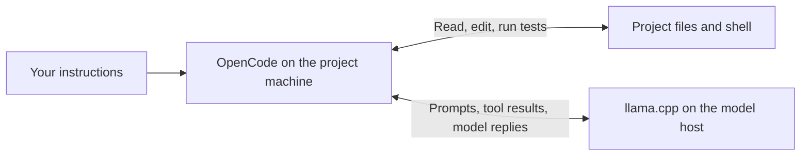

# local_agent

A local coding agent powered by llama.cpp, with Nix setup and SSH model hosting.

This repository sets up a coding agent you run from your terminal. You give
it a task, such as explaining a project or fixing a failing test, and it can
read project files, edit code, and run shell commands and tests on your behalf.

There are two parts: **OpenCode** provides the chat interface and executes
file/shell tools; **llama.cpp** runs the selected model that decides what to do next.
Setup downloads the weights, prepares these runtimes, and installs the `local_agent`
command on your PATH. Model inference runs on your own machine, or on your
chosen model host over SSH.



The project machine and model host can be the same box. With `local_agent --host
gpu-box`, the agent and its tools stay on the calling machine; only model
requests go over SSH. OpenCode uses your normal account permissions, with
edits and shell commands allowed by the shipped configuration. See
[OpenCode](#opencode) for details. Web search uses a separate hosted Exa
service; it is not part of local model inference.

The supplied hardware preset targets an RTX 3090 with 24 GB VRAM.
You can select another NVIDIA architecture, a Vulkan GPU backend, or CPU
operation in [`config.toml`](config.toml) and local overrides.
See [Hardware and configuration](#hardware-and-configuration).
The launchers target x86_64 Linux with Nix; a machine using a remote model
does not need a GPU or GPU drivers.

## Start chatting

`chat.sh` is the only script at the repository root:

```bash
./chat.sh
./chat.sh /path/to/project  # work on another project
./chat.sh --list-models     # list the model catalog
./chat.sh load              # load the model without opening chat
./chat.sh shutdown          # stop the model and release its memory
```

Chat installs missing runtimes, downloads missing model weights, loads the
model automatically, and leaves it running after you exit. Downloads resume
after interruptions and are checked for the expected byte size before use.
Only the model host needs the weights and inference hardware; see [Using another model host](#using-another-model-host).
After running setup, `local_agent`, `local_agent load`, and `local_agent shutdown` work from any directory.

Setup and maintenance helpers are in `scripts/`; Nix build definitions are in
`nix/`.

### Work on a project

After setup, use one command from the project you want to work on:

```bash
local_agent                                  # open chat
local_agent run "Explain this project"        # one task, no UI
local_agent run "Fix the failing test"
local_agent --host gpu-box                    # use an SSH model host
```

Put `--model` and host options before OpenCode arguments. Remaining arguments
go to OpenCode; `local_agent --help` shows the available options. Use `load`,
`shutdown`, and `--list-models` to manage the model without opening chat.

## Setup on a fresh machine

Prerequisites: Nix with `flakes` and `nix-command` enabled, enough disk space
for the selected model plus the Nix builds, and the drivers for your selected
backend. The default CUDA preset needs an NVIDIA driver (`nvidia-smi` works);
CPU operation does not.
The launchers also use Bash, curl, GNU coreutils, and `flock` (util-linux);
automatic model startup uses a systemd user session. The pinned OpenCode
runtime currently targets x86_64 Linux.

```bash
git clone https://github.com/jgoppert/local_agent.git ~/git/local_agent
cd ~/git/local_agent
# For other hardware, create config.local.toml as described below before setup.
./scripts/setup.sh
```

`scripts/setup.sh` builds llama.cpp for the configured backend from a pinned
nixpkgs revision ([`nix/llama-cpp.nix`](nix/llama-cpp.nix); the default CUDA build
can take 10-20 minutes the first time), downloads the selected model's weights,
prepares OpenCode locally, and adds `local_agent` to your user Nix profile as
one `local_agent-tools` entry. Both normal setup and `setup.sh --client` install
the command on PATH. The latter prepares a machine that uses an SSH model
host, without building the server or downloading weights. Nix's shell
initialization makes the profile available; start a new login shell if Nix
was just installed.

The installer replaces earlier entries when rerun. The commands point to this
checkout, so keep it in place. After moving it, rerun setup or
`./scripts/install-profile.sh` to update just the commands. To remove them:
`nix profile remove local_agent-tools`. `./chat.sh` also works without installation.

Setup is safe to rerun: existing runtimes and weights are reused, and the
profile commands are refreshed.

For an existing installation, see the [migration guide](docs/migration.md).

You can also run `./chat.sh` directly after cloning: it prepares the runtimes
and downloads the model on first use. `./chat.sh load` prepares only the server.
Setup also installs the command on PATH.

The optional NVIDIA power-cap helper uses `power.watts` from the configuration
(250 W in the 3090 preset). It runs only when you explicitly invoke
`./scripts/powercap.sh`, needs `sudo`, and resets on reboot. See
[Keeping the GPU cool](#keeping-the-gpu-cool).

## Hardware and configuration

[`config.toml`](config.toml) contains the shared defaults. On the **model
host**, create `config.local.toml` containing only the values you want to
override. It is ignored by Git, so machine-specific settings stay local.
Alternatively, set `LOCAL_AGENT_CONFIG=/absolute/path/to/settings.toml`; that file
replaces the local override file and is merged with the shared defaults.
These are TOML data files, parsed by Nix, not shell scripts.

| Backend | What it needs | What to configure |
|---|---|---|
| `cuda` (default) | NVIDIA GPU and driver | `cuda_capabilities` for your GPU; default `["8.6"]` targets the 3090 |
| `vulkan` | GPU and a compatible Vulkan driver, including supported AMD/Intel devices | `backend = "vulkan"`; adjust GPU layers and cache settings to fit |
| `cpu` | Enough system RAM for weights and context | `backend = "cpu"`; GPU offload is forced to zero |

These backend choices map to the pinned llama.cpp build's CUDA, Vulkan, and
CPU options. See the [upstream build documentation](https://github.com/ggml-org/llama.cpp/blob/master/docs/build.md)
for backend requirements. The 3090 preset is the configuration measured on
this machine; other GPUs still need validation on their actual hardware.
The bundled OpenCode binary and service scripts currently target x86_64
Linux, so selecting a backend does not add macOS or Windows launcher support.

For another NVIDIA card, set its [CUDA compute capability](https://developer.nvidia.com/cuda/gpus).
For example, an RTX 4090 uses:

```toml
# config.local.toml
[hardware]
backend = "cuda"
cuda_capabilities = ["8.9"]
```

For CPU operation, this is a conservative starting configuration:

```toml
# config.local.toml
[hardware]
backend = "cpu"

[server]
context = 8192
threads = 8
flash_attention = "auto"
cache_type = "f16"
speculation = "none"
```

For Vulkan, change the backend in that example to `"vulkan"`. If the model
does not fit in GPU memory, add `gpu_layers = 20` under `[server]` and tune
that count for your hardware. Lowering the context also reduces memory use.
Memory requirements depend on the selected weights, context, and runtime.
CPU operation and partial GPU offload can be substantially slower.
This configuration does not choose a smaller model automatically; use
`--model NAME` to select another entry in the [model catalog](#choosing-and-adding-models).

Server settings also include parallel slots, maximum output tokens, reasoning
effort, and MTP speculative decoding. The default enables MTP for the bundled
model. Use `speculation = "none"` when you want to disable it. CUDA compute
capabilities affect the build; the other server settings affect launch flags.

After changing configuration, restart the model on its host:

```bash
local_agent shutdown
local_agent load
```

The next load checks the configured build and rebuilds if its backend or CUDA
architecture changed. An already-running model keeps its existing settings
until restarted. SSH clients use the **model host's configuration**; their
local hardware configuration is not sent to the host. Explicit `CTX` and
`REASONING` environment overrides still take precedence, including over SSH.
`PORT` remains the model API port; SSH connection settings belong in
`~/.ssh/config`.

The launcher generates OpenCode model settings from the selected
preset, including context and output limits. With multiple parallel slots,
the client receives the per-slot context. SSH clients get these settings from
the model host. Restart the server after changing its inference settings so
the running server and generated client limits agree.

## Choosing and adding models

[`models.toml`](models.toml) is the shared catalog of downloadable GGUF models.
Select a catalog ID before client arguments. Replace `MODEL` below with a
name from `--list-models`:

```bash
local_agent --list-models
local_agent --model MODEL
local_agent --model MODEL run "Explain this project"
local_agent --host gpu-box --list-models
local_agent --host gpu-box --model MODEL load
./scripts/setup.sh --model MODEL
./scripts/download-model.sh --model MODEL
./scripts/run.sh --model MODEL
```

`-m NAME` and `--model=NAME` also work. `LOCAL_AGENT_MODEL=NAME` sets an environment
default; an explicit flag wins. Set `[model] default = "NAME"` in
`config.local.toml` for a persistent default. Setup's flag selects which
weights to prepare; it does not change that default. Over SSH, the catalog
and default belong to the model host, so clients need no copy of custom entries.

### Default model

Setup prepares **Qwen3.8-27B Q4_K_M** by default, using the `qwen3.8-27b`
catalog entry. The [model weights](https://huggingface.co/unsloth/Qwen3.8-27B-GGUF)
occupy about 16.5 GB. Its preset enables MTP speculative decoding and is tuned
for the shipped RTX 3090 hardware configuration. The model and hardware presets
can both be changed.

The model card recommends `temperature = 0.7`, `top_p = 0.8`, `top_k = 20`,
and `presence_penalty = 1.5` for instruct mode; thinking mode uses
`temperature = 1.0` and `top_p = 0.95`. These recommendations are specific to
the default model. See its [hardware guide](https://www.contextstudios.ai/blog/qwen-3-8-27b-hardware-guide)
for additional background.

### Add a model

To add a model, append a table to `models.toml`. This is a template: replace
the filename, URL, byte size, and limits with the actual model's values.
Use a model with tool-calling support that the pinned llama.cpp can load.

```toml
["my-model"]
name = "My coding model"
file = "my-model.Q4_K_M.gguf"
url = "https://huggingface.co/OWNER/REPO/resolve/REVISION/my-model.Q4_K_M.gguf"
size = 1234567890 # Exact byte size of the downloaded GGUF; replace this value

["my-model".server] # Optional settings specific to this model
context = 8192
max_tokens = 1024
speculation = "none"
```

For a private entry, put the same tables in `config.local.toml` using
`[models."my-model"]` and `[models."my-model".server]`. Local entries can
also override existing catalog entries. IDs use letters, digits, dots,
underscores, or hyphens; quote IDs containing dots in TOML. Each model needs
a unique GGUF filename. The downloader currently handles one GGUF per entry;
split files and separate vision projectors are not supported by this catalog.

Server settings merge in this order: shared `config.toml` defaults, the selected
model's `server` table (including local model overrides), local `[server]`
settings, then `CTX` and `REASONING`. New models default to no speculative
decoding; model presets can enable it when supported.

The service runs one selected model at a time. To switch a loaded server:

```bash
local_agent shutdown
local_agent --model my-model
```

The launcher checks the API's model ID before reusing a server and reports a
mismatch instead of sending tasks to another model. Shutdown affects active
clients. For an SSH host, put `--host gpu-box` before both commands.

### OpenCode's native model selection

OpenCode already supports a `provider.models` catalog, `--model provider/model`,
and the `/models` picker. Its [llama.cpp provider configuration](https://opencode.ai/docs/providers/#llamacpp)
connects those model IDs to an API endpoint; it does not choose the GGUF loaded
by this repository's single-model server.

The launcher generates the selected entry in that native format, layered over
`opencode.json` using [OpenCode's inline configuration](https://opencode.ai/docs/config/#precedence-order).
The repo's catalog also supplies the download URL, file size, and server flags.
Wrapper model flags must precede OpenCode arguments; flags after `run` or `--`
are passed to OpenCode and do not select the server's weights.

For switching loaded models directly from `/models`, llama.cpp offers a native
[router with model presets](https://github.com/ggml-org/llama.cpp/tree/master/tools/server#model-presets)
and automatic loading. That would require running this repo's server in router
mode and exposing the full catalog to OpenCode; these launchers currently use
one model per server process.

## Using it

### Using another model host

Run the client on the machine whose files you want to work with, and specify
the model host with `--host`. The client runs all file reads, edits, and shell
commands on the **calling machine**, in the project you open. Model requests
(including prompts, relevant file contents, and tool results) travel through
an encrypted [SSH local port forward](https://man.openbsd.org/ssh#L) to the
model host. The model weights stay on that host.

On the model host, satisfy the server prerequisites above and install the
`local_agent` command on your PATH. The checkout can live anywhere:

```bash
git clone https://github.com/jgoppert/local_agent.git ~/git/local_agent
cd ~/git/local_agent
./scripts/setup.sh  # prepare runtimes and weights, and install local_agent on PATH
local_agent load           # optional: load the model now
```

If `local_agent` is already on your PATH, no extra installation is needed. To install
only the commands and let the first remote launch prepare the server and
download weights, use `./scripts/install-profile.sh` instead of full setup.
Ensure you can log into this machine over SSH.

For a fresh NixOS model host, enable SSH in its system configuration and apply
it with `sudo nixos-rebuild switch` ([NixOS SSH setup](https://wiki.nixos.org/wiki/SSH#Setup)):

```nix
services.openssh = {
  enable = true;
  openFirewall = true;
};
```

This uses SSH port 22 by default. The model server binds to `127.0.0.1:8080`;
the SSH launcher forwards to it, so no firewall opening for port 8080 is needed.
The SSH account must permit local TCP forwarding. To prepare the model before
the first client connects, run `local_agent load` on the model host.

`--host` accepts the same alias you use with `ssh`. The launcher uses your
normal `~/.ssh/config`, including its configured port, user, identity file,
and jump host. Port 22 is SSH's fallback; the launcher does not force it.
If you already have a working SSH alias, use it directly:

```bash
~/git/local_agent/chat.sh --host gpu-box
```

To define a new alias, add an entry to **the client's** `~/.ssh/config`:

```sshconfig
Host gpu-box
    HostName gpu-box
    User your-user
    Port 22
```

Replace the hostname (or use the server's IP address), user, and port with your
host's values; keep those connection details in your local SSH configuration.
Verify `ssh gpu-box true`, then use `--host gpu-box` below.

On each client machine (x86_64 Linux with Nix, Bash, curl, GNU coreutils, and
OpenSSH; no NVIDIA driver or systemd user service required):

```bash
git clone https://github.com/jgoppert/local_agent.git ~/git/local_agent
~/git/local_agent/scripts/setup.sh --client  # install the client and local_agent on PATH
cd ~/git/my-project
local_agent --host user@gpu-box
local_agent --host user@gpu-box run "Fix the failing tests"
local_agent --host user@gpu-box /path/to/another/project
```

The launcher starts the model remotely, waits for it to become ready, and
opens chat locally. Exiting chat closes its SSH tunnel and leaves the model
loaded for the next client. `load` and `shutdown` also accept `--host`:

```bash
~/git/local_agent/chat.sh --host gpu-box load
~/git/local_agent/chat.sh --host gpu-box shutdown  # stops the shared model for everyone
~/git/local_agent/chat.sh --host gpu-box --remote-dir /srv/local_agent
```

SSH aliases from `~/.ssh/config` work, including custom users, ports, keys,
and jump hosts. By default, the launcher finds the executable `local_agent` on the
remote user's PATH using a Bash login shell, so profile-installed commands
are available. It does not assume a checkout location. To check discovery:

```bash
ssh gpu-box 'bash -lc "command -v local_agent"'
```

If you prefer to use an uninstalled checkout, `--remote-dir /srv/local_agent` (or
`LOCAL_AGENT_REMOTE_DIR`) explicitly selects its `chat.sh` instead. Relative paths
are resolved under the remote user's home; absolute paths and `~/...` also
work. Put these launcher options before OpenCode arguments.

To make this your default after setup:

```bash
export LOCAL_AGENT_HOST=user@gpu-box
local_agent
```

Unset `LOCAL_AGENT_HOST` to use a local model again. `PORT` selects the model host's
API port (default 8080); the SSH port comes from your SSH configuration.
`--local-port` or `LOCAL_AGENT_LOCAL_PORT` selects the
client's loopback tunnel port (default 18080). For a second simultaneous chat
on the same client, use a different port, e.g. `--local-port 18081`. An occupied
port fails explicitly. The model API remains bound to localhost; SSH is the
only network service needed. The current server has one inference slot, so
multiple clients share its capacity.

If your project is on a third machine, SSH into that machine and invoke
`chat.sh --host gpu-box` there. Tools then act on that third machine's files.

### OpenCode

OpenCode with the same model, configured by [`opencode.json`](opencode.json).
It has no OS sandbox, and the shipped configuration allows
file edits, shell commands, and access outside the project without prompting.
It runs with your normal user permissions.

```bash
cd ~/git/my-project
~/git/local_agent/chat.sh                             # full-screen UI
~/git/local_agent/chat.sh -c                          # resume the last session
~/git/local_agent/chat.sh run "Explain this project"  # one task, no UI
~/git/local_agent/chat.sh session list
```

Inside the UI: Tab switches between Build and Plan, `/undo` reverts the last
message and its file edits (Git repositories only), `/sessions` lists saved
conversations, Ctrl+P opens the command menu, `@` attaches a file. Web search
uses OpenCode's hosted Exa integration, so search queries leave the machine.
Model inference runs on your chosen local or SSH model host.

### The API

The server speaks the OpenAI API on `http://127.0.0.1:8080` (`/v1/chat/completions`,
`/v1/responses`) with no key required, and serves a web UI at the same address.
It listens on localhost only; from another machine use an SSH tunnel:
`ssh -N -L 18080:127.0.0.1:8080 <host>`, then connect an API client to
`http://127.0.0.1:18080/v1`. `chat.sh --host <host>` handles this automatically.

## The model server

By default, [`scripts/run.sh`](scripts/run.sh) starts `llama-server` with all layers on the GPU, 32k
context, q8_0 KV cache, low reasoning effort, and MTP speculative decoding
(the draft head shipped inside the GGUF). The 3090 preset uses about 18 GB of
VRAM and takes about a minute to load. Configuration can change these settings.

The launcher starts it automatically as a transient user service
named `local_agent-model` and leave it loaded so the next session starts instantly.

Use `./chat.sh load` to start just the model and wait until it is ready, and
`./chat.sh shutdown` to stop it and release its model memory. Repeating either
command is safe. `start` is an alias for `load`; `stop` and `unload` are aliases
for `shutdown`. Shutdown also handles servers started directly from this
checkout with `scripts/run.sh`, including older launches outside the service.
It ends any active requests to the server.

```bash
./chat.sh load
./chat.sh shutdown                # release model memory
systemctl --user status local_agent-model
journalctl --user -u local_agent-model -n 40
./scripts/run.sh                  # run it in the foreground instead
```

Environment overrides for `scripts/run.sh` (and the launchers): `CTX` (context length,
default from `server.context`), `REASONING` (`none`, `low`, `medium`, `high`;
default from `server.reasoning`), `PORT` (default 8080), `LOCAL_AGENT_MODEL`
(catalog ID; overridden by `--model NAME`), and `LOCAL_AGENT_CONFIG`
(optional absolute path to a local TOML override file). See the hardware
configuration section for client context-limit settings.

## Keeping the GPU cool

The following measurements and power-cap defaults are specific to the RTX
3090 preset, rather than requirements for other hardware. Measured with a
250 W cap: 49 tokens/s generation with speculative decoding (32 tokens/s
without), 169 tokens/s prompt processing, and peak GPU temperature 49 C.

The NVIDIA helper controls the power limit. Under
the 250 W cap the card held 48-49 C during generation on this machine, with the
limit fully used during prompt processing. Generation is memory-bandwidth bound,
so the cap costs little speed there. `./scripts/powercap.sh 200` gives more margin at
some speed cost; the driver floor on a 3090 is 100 W.
Choose a limit supported by your own card. Set `[power] watts = 0` to make the
helper a no-op, or pass a wattage explicitly. The helper rejects non-CUDA
configurations, and setup never applies a power cap automatically.

```bash
./scripts/gpu-status.sh          # temp, power, memory, utilization
./scripts/gpu-status.sh watch    # refresh every 2 s
```

A loaded but idle server sits around 35-40 C. Stop the service if the machine
will sit unused for a long time.

## Files

| File | Purpose |
|---|---|
| `chat.sh` | start OpenCode, load the model, or shut it down |
| `config.toml`, `config.local.toml` | shared hardware/inference defaults and ignored local overrides |
| `models.toml` | shared model catalog: GGUF downloads and optional server settings |
| `nix/config.nix`, `nix/runtime-config.nix`, `scripts/read-config.sh` | validate TOML and supply build/launch settings |
| `nix/client-config.nix`, `nix/model-list.nix`, `nix/server-matches.nix` | generate native OpenCode model settings, list presets, and verify the running model |
| `scripts/model-options.sh` | shared parsing for model selection flags |
| `scripts/setup.sh` | prepare runtimes and install commands on the user PATH |
| `scripts/download-model.sh` | download/resume weights and check their byte size |
| `scripts/ensure-runtime.sh` | prepare just the client or server runtime |
| `scripts/remote-chat.sh` | start the remote model and manage an SSH tunnel for local chat |
| `scripts/test-launchers.sh` | isolated launcher checks without a GPU or downloads |
| `scripts/install-profile.sh`, `nix/profile.nix` | install Nix profile commands; called by setup |
| `scripts/run.sh` | start `llama-server` |
| `scripts/ensure-model.sh` | shared model startup helper |
| `scripts/shutdown.sh` | stop the model and release its GPU memory |
| `opencode.json`, `nix/opencode.nix` | OpenCode configuration and pinned binary |
| `nix/llama-cpp.nix` | pinned llama.cpp with configurable CUDA, Vulkan, or CPU backend |
| `scripts/powercap.sh`, `scripts/gpu-status.sh` | GPU power cap and readout |
| `models/`, `llama-cpp`, `.opencode-runtime`, `.profile-runtime` | downloaded and built artifacts, ignored by Git |

## Committing the repository

`.gitignore` excludes `models/` (including partial downloads), common weight
formats anywhere in the checkout, Nix output links, `config.local.toml`, and local `.env` files.
Only scripts and configuration need to be committed; fresh clones fetch
weights when needed. Preview what Git would add with `git add --dry-run .`.
Ignored files that were already tracked would need `git rm --cached` first;
this checkout had no tracked files when these rules were added.

Run `./scripts/test-launchers.sh` to check automatic setup, download recovery,
TOML configuration, adding/selecting models, client limits, runtime flags, SSH argument handling, working-directory preservation, and tunnel cleanup
using isolated mock commands. These checks do not connect to an SSH host.

Reference:
[OpenCode llama.cpp provider](https://opencode.ai/docs/providers/#llamacpp).
